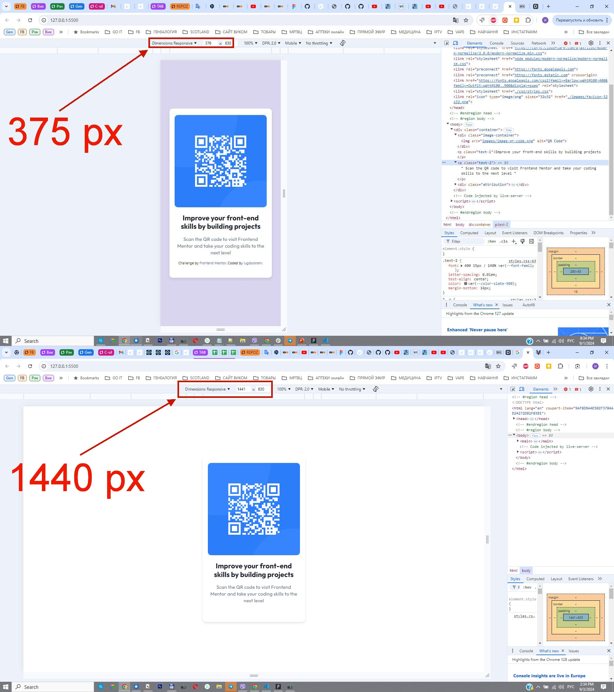

# Frontend Mentor - QR code component solution

This is a solution to the [QR code component challenge on Frontend Mentor](https://www.frontendmentor.io/challenges/qr-code-component-iux_sIO_H). Frontend Mentor challenges help you improve your coding skills by building realistic projects.

## Table of contents

- [Screenshot](#screenshot)
- [Links](#links)
- [My process](#my-process)
- [Built with](#built-with)
- [What I learned](#what-i-learned)
- [Continued development](#continued-development)

### Screenshot of my first task "QR code component"

### Links

- Solution URL: https://github.com/lugdockrem/QR-code-component

- Live Site URL: https://lugdockrem.github.io/QR-code-component/

## My process

I'm a newbie. I'm from Ukraine and I recently started studying the FullStack Developer course on the Ukrainian online educational platform GoIT LMS. In the first stage, I studied Precourse 2.0, Soft Skills 1.1, and HTML+CSS 2.1, including the Mobile-first workflow.

### Built with

- Semantic HTML5 markup
- CSS custom properties
- Flexbox
- Mobile-first workflow

### What I learned

I studied Precourse 2.0, Soft Skills 1.1, and HTML+CSS 2.1, including the Mobile-first workflow. But to be honest, my head is a bit of a mess right now because I've learned a lot of material in a short period of time. I need to keep improving myself.

### Continued development

In the future, I plan to learn JavaScript 3.0, Node.js, React, and more.
